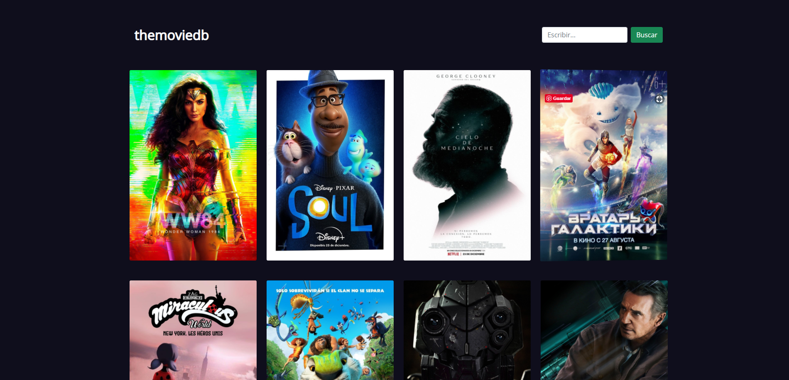
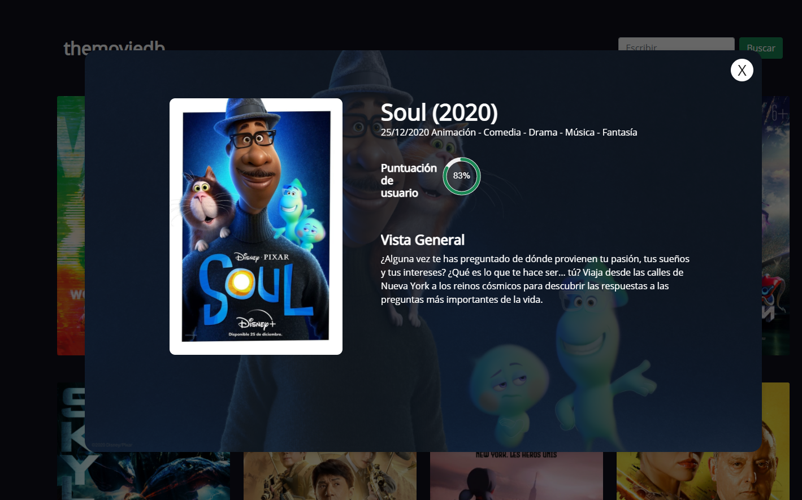
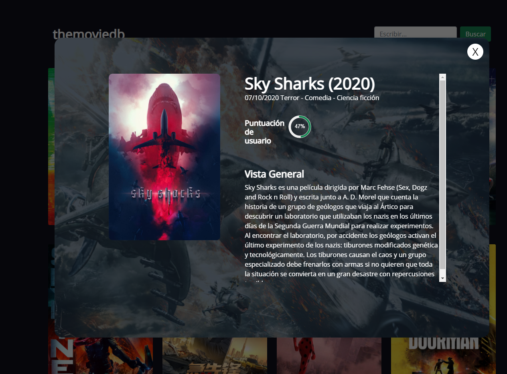

# Proyecto THE MOVIE DATABASE 
## Aplicacion PHP + API de TMDB

### Funciones de la Aplicación
Esta aplicacion esta basada en PHP y consume la api de la plataforma de peliculas The Movie Database [themoviedb](https://www.themoviedb.org/)

| Acciones   | Archivo |
| ------ | ------   |
| Cargar Peliculas |   :heavy_check_mark:  |
| Detalle de cada Pelicula |  :heavy_check_mark:   |
| Buscar Peliculas |   :memo: **En desarrollo**  |

### Clave de la API :key:
Para poder usar la aplicacion tenemos que crearnos una cuenta en https://www.themoviedb.org/ .
Luego tenemos que generar la clave de la API, y colocarla en el archivo a continuacion.


| Ruta   | Archivo |
| ------ | ------   |
| resources | api_key_tmdb.php    |

```php
<?php

//Colocar aqui la Clave de la API (v3 auth), que se obtendra al crear una cuenta en https://www.themoviedb.org/
$API_KEY = 'CLAVE_API';

```
# Screenshot de la Aplicación
## **Index** :computer:
[](pictures_app/tmdb_1.png)


[](pictures_app/tmdb_2.png)

## **Detalle de Pelicula** :movie_camera:

[](pictures_app/tmdb_modal_1.png)


[](pictures_app/tmdb_modal_2.png)

# Correr Aplicación
Para poder levantar un servidor web interno de php, debemos estar dentro de la carpeta donde se encuentra los recursos y tipear en consola

```php
php -S localhost:8000
```


>**Nota** :eyes:
Tener en cuenta que el nombre de la carpeta en donde se almacenara la aplicacion tiene que ser igual al nombre que se le da RewriteBase en el archivo `.htaccess`
